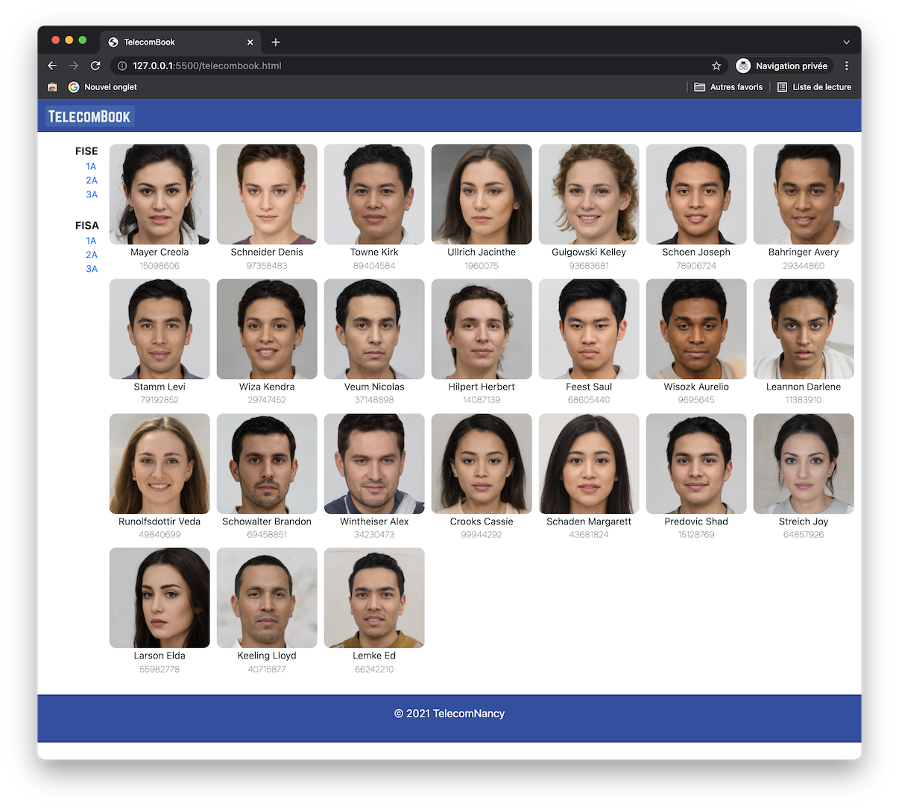
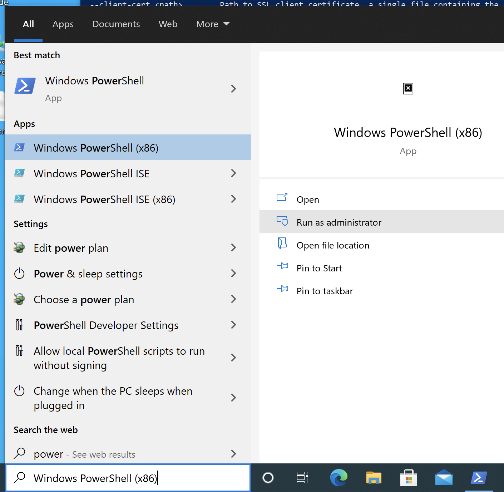

# Lab #1 - Web Programming

## Objectifs

L'objectif de cette séance est de se familiariser avec les technologies du Web (HTML, CSS, HTTP) afin de réaliser quelques "pages web" et ensuite une application web de gestion de trombinoscope en utilisant le framework Python `Flask` et un petit modèle relationnel.


## Étape 1 - Mise en place d'un environnement virtuel Python

> Les programmes Python utilisent souvent des paquets et modules qui ne font pas partie de la bibliothèque standard. Ils nécessitent aussi, parfois, une version spécifique d'une bibliothèque [..]
>
>Cela signifie qu'il n'est pas toujours possible, pour une installation unique de Python, de couvrir tous les besoins de toutes les applications. [...]
>
> La solution est de créer un environnement virtuel, un dossier auto-suffisant qui contient une installation de Python pour une version particulière de Python ainsi que des paquets additionnels
> 
> -- <cite>[Extrait du tutoriel officiel Python 3 - Environnements virtuels et paquets](https://docs.python.org/fr/3/tutorial/venv.html)</cite>

Voici comment procédez sous un shell de type `sh`. *(les commandes spécifiques à Windows sont présentées en fin de document)*

```sh
$ cd lab3-oster7 # positionnons nous dans votre dépôt git local 
                 # que vous aurez clonez auparavant

$ python3 -m venv env # ceci à pour effet de vous créer un répertoire
                      # env/ ou sera stocké votre environnement virtuel 
                      # (package, les versions de python3, pip3, ...)

$ source env/bin/activate # on active l'environnement en exécutant
                          # le script d'activation

(env) $ pip install Flask # pour installer les packages utiles
                          # pour Flask
```

On peut noter la présence de l'indication `(env)` en tête d'invite de commande vous confirmant que l'environnement est bien activé.

Votre environnement virtuel ne doit pas être ajouté/publié dans votre dépôt git. Le mieux est donc d'ajouter le répertoire `env/` avec votre fichier .`gitignore`

```sh
(env) $ echo 'env/' >> .gitignore # on indique à git d'ignorer 
                                  # le répertoire env/
```

Puisque votre environnement n'est pas publié sur git, il est intéressant de garder trace des librairies installées afin de pouvoir créer un nouvel environnement lorsque l'on clone votre dépôt -- sur une autre machine par exemple --.

```sh
(env) $ pip freeze # retourne la liste des librairies 
                  # et leurs dépendances installées

click==8.0.3
Flask==2.0.2
itsdangerous==2.0.1
Jinja2==3.0.3
MarkupSafe==2.0.1
Werkzeug==2.0.2

(env) $ pip freeze > requirements.txt # on conserve cette liste dans
                                      # un fichier requirements.txt
```

L'avantage est que l'on peut utiliser le fichier `requirements.txt` pour installer toutes les dépendances mentionnées. Il est donc bienvenu d'ajouter/publier ce fichier à votre dépôt git.

```sh
(env) $ pip install -r requirements.txt # ne devrait pas avoir d'effet 
                                        # puisque vous avez déjà 
                                        # installées toutes les 
                                        # librairies mentionnées
```


```sh 

(env) $ deactivate # permet de desactiver l'environnement virtuel
$                  # plus de (env) devant l'invite de commande, 
                   # il est donc bien désactivé
```


## Étape 2 -- Une première page web

Dans cette étape, nous vous invitons à réaliser une première page HTML permettant d'illustrer un trombinoscope. À titre d'exemple, vous trouverez ci-dessous un exemple de capture d'écran de ce que vous pourriez réaliser.



Dans un premier temps, vous vous contenterez de réaliser une page statique (aucun server n'est donc nécessaire pour générer les pages).

Afin de faciliter votre travail, nous vous invitons à installer l'extension LiveServer (https://marketplace.visualstudio.com/items?itemName=ritwickdey.LiveServer) dans votre environnement VisualStudio Code. Cette extensions permet de démarrer un serveur HTTP qui vous "sert" le contenu d'un répertoire à travers le protocole HTTP.

Vous trouverez dans le répertoire `data/`, un fichier dénommé `students.csv` contenant des informations concernant des étudiants fictifs. Vous pourrez y retrouver leur nom, prénom et identifiant d'étudiant, ainsi que le chemin vers leur photo.

```csv
photos/MTc5MTc1LmpwZw.jpg,Ullrich Jacinthe,1960075
photos/MjI2ODU4LmpwZw.jpg,Gulgowski Kelley,93683681
photos/MjI4ODUzLmpwZw.jpg,Schoen Joseph,78906724
photos/MjI5NDA2LmpwZw.jpg,Bahringer Avery,29344860
...
```

On ne vous demande pas d'écrire du code pour charger ce fichier. Vous pouvez vous contenter de faire un copier-coller des valeurs qui vous intéressent.


Vous pouvez réaliser plusieurs pages pour plusieurs "promotions" et mettre en place des liens hypertextes liant ces différentes pages.

- Pour un formattage basique : 
  [HTML_text_fundamentals](https://developer.mozilla.org/en-US/docs/Learn/HTML/Introduction_to_HTML/HTML_text_fundamentals)
- Pour créer des liens entre les pages : 
  [Creating_hyperlinks](https://developer.mozilla.org/en-US/docs/Learn/HTML/Introduction_to_HTML/Creating_hyperlinks)


## Étape 3 -- Un premier serveur web

Suivez le tutoriel Flask (https://flask.palletsprojects.com/en/2.0.x/quickstart/) pour créer votre premier "serveur web". Il suffit de recopier le code suivant dans un fichier `hello.py`.

```python
from flask import Flask
app = Flask(__name__)

@app.route('/')
def hello_world():
    return 'Hello, World!'
```

Dans votre shell (avec l'environnement virtuel actif), vous pouvez lancer ce serveur
```sh
(env) $ export FLASK_APP=hello.py
(env) $ flask run
```

Sous Windows (PowerShell), il faut utiliser la commande suivante :
```powershell
(env) PS C:\>  $env:FLASK_APP = "hello.py"
(env) PS C:\>  flask run
```


Vous pouvez dès à présent, accéder au contenu servi par votre serveur en utilisant votre navigateur web habituel et en vous rendant à l'adresse [http://127.0.0.1:5000/](). Si vous avez besoin de quelques explications sur la signification de cette URL (http://127.0.0.1:5000/), n'hésitez pas à demander à votre enseignant.


### Beaucoup de choses à tester

- Essayez de modifier le contenu retourné par votre serveur.
- Essayez d'ajouter d'autres contenus servis sur d'autres URI 
  - par exemple `/lists` retourne un contenu présentant une potentielle liste des années de la formation.
 
    > **FISE**
    > * [1A](FISE1A)
    > * [2A](FISE2A)
    > * [3A](FISE3A)
    >
    > **FISA**
    > * [1A](FISA1A)
    > * [2A](FISA2A)
    > * [3A](FISA3A)
  - Regarder comment vous pouvez servir du contenu statique (les pages HTML que vous avez réalisées lors de la seconde étape) en utilisant le framework Flask (https://flask.palletsprojects.com/en/2.0.x/quickstart/#static-files)

  - Tester l'écriture de différentes routes. Par exemple la route `/lists/fise1a` pourrait vous retourner un contenu présentant une liste d'étudiants.
  ```python
  [
    [ 'photos/MTA2NDY4LmpwZw.jpg', 'Mayer Creola', 15098606 ],
    [ 'photos/MTA5NTA0LmpwZw.jpg', 'Schneider Denis', 97358483 ],
    [ 'photos/MTc4NjY4LmpwZw.jpg', 'Towne Kirk', 89404584 ],
    [ 'photos/MTc5MTc1LmpwZw.jpg', 'Ullrich Jacinthe', 1960075 ],
    [ 'photos/MjI2ODU4LmpwZw.jpg', 'Gulgowski Kelley', 93683681 ],
    ...
  ]
  ```

  **Rappel** : La gestion des URIs de type `/lists/fise1a` peut s'effectuer en utilisant une annotation du type `app.route('/lists/<int:str>)`, la valeur `list_id` étant alors passée automatiquement à votre fonction sous forme de paramètre. 


 - Testez le passage de paramètre dans les routes, par exemple `/lists?formation=fise&year=1a` permet d'accéder au contenu précédent.
- Essayez maintenant de charger les données que vous "servez" à partir de fichiers `.csv`.
- Regardez du côté des templates (https://flask.palletsprojects.com/en/2.0.x/quickstart/#rendering-templates) pour générer vos pages HTML.


## Étape 3 -- Utilisation des données de la base relationnelle

Vous allez maintenant modifier votre programme (serveur) pour servir un contenu qui sera généré dynamiquement à partir du contenu de votre base relationnelle.

Ajouter dans votre répertoire le fichier correspondant à votre base relationnelle au format sqlite (dans la suite, nous utiliserons `trombi.db`). Pensez à insérer quelques données dans votre base.

Vous aurez besoin de consulter :

- la documentation de la librairie sqlite3 pour Python : 
  https://docs.python.org/3/library/sqlite3.html
- le tutoriel Flask dédié à sqlite3 : 
  https://flask.palletsprojects.com/en/2.0.x/patterns/sqlite3/#sqlite3


Voici un exemple très basique de ce que vous devriez faire et surtout compléter :

```python
from flask import Flask
from flask import g

import sqlite3

DATABASE = 'trombi.db' # le nom du fichier de votre base sqlite3

app = Flask(__name__)

def get_db(): # cette fonction permet de créer une connexion à la base 
              # ou de récupérer la connexion existante 
    db = getattr(g, '_database', None)
    if db is None:
        db = g._database = sqlite3.connect(DATABASE)
    return db

@app.teardown_appcontext
def close_connection(exception):  # pour fermer la connexion proprement
    db = getattr(g, '_database', None)
    if db is not None:
        db.close()


@app.route('/')
def index():
    return 'TelecomBook is running!'


@app.route('/students')
def all_students():
    c = get_db().cursor() # on crée un curseur
    c.execute("select * from students") # on exécute la requête

    content = '<b>Students</b>' 

    content += '<ul>'
    for tpl in c.fetchall(): # on parcours les tuples résultat 1 par 1
        content += f'<li>{tpl[1]}</li>'
    content += '</ul>'
    
    return content
```


### Vers l'infini et au-delà !

Voilà vous avez quasiment tout pour créer votre application (tout du moins en mode consultation).

Ensuite, il faudra regarder du côté des formulaires HTML pour pouvoir permettre à l'utilisateur de saisir des données, des requêtes HTTP POST pour pouvoir envoyer ces données et les insérer dans votre base de données.

----

### Création/activation de l'environnement sous Windows (PowerShell)

Nous ne vous conseillons pas pour les TPs de CS54 de travailler directement sous votre environnement Windows.
Nous vous invitons plutôt à utiliser la machine virtuelle sous VirtualBox qui vous a été fournie. Si vous utilisez tous le même environnement, nous pourrons plus facilement apporter de l'aide à chacun, plutôt que de passer beaucoup de temps avec un(e) seul(e) élève pour résoudre son problème sur son environnement spécifique.

Toutefois, l'ensemble des développements que vous réalisez peuvent normalement fonctionner sous Windows ou tout autre système d'exploitation moderne.

Vous pouvez procéder de la même manière sous un shell PowerShell

```powershell
PS C:\> cd lab3-oster7 # positionnons nous dans votre dépôt git local 
                       # que vous aurez clonez auparavant

PS C:\> python3 -m venv env # ceci à pour effet de vous créer un
                            # répertoire env/ 
                      # ou sera stocké votre environnement virtuel 
                      # (package, les versions de python3, pip3, ...)

PS C:\> .\env\Scripts\activate # on active l'environnement 
                               # en exécutant le script d'activation
```


Si vous obtenez une erreur au moment de l'exécution du script, il faut modifier la politique de sécurité de votre système pour autoriser l'exécution des scripts. Pour cela, il faut exécuter un shell PowerShell en mode administrateur (cf.capture d'écran) puis saisir la commande suivante :



```powershell
PS C:\> Set-ExecutionPolicy AllSigned
```

Une fois un nouvel PowerShell lancé, vous devriez pouvoir exécuter le script d'activation.


```powershell
PS C:\> \env\Scripts\activate
(env) PS C:\>  #  on constate que l'environnement (env) est actif
```
